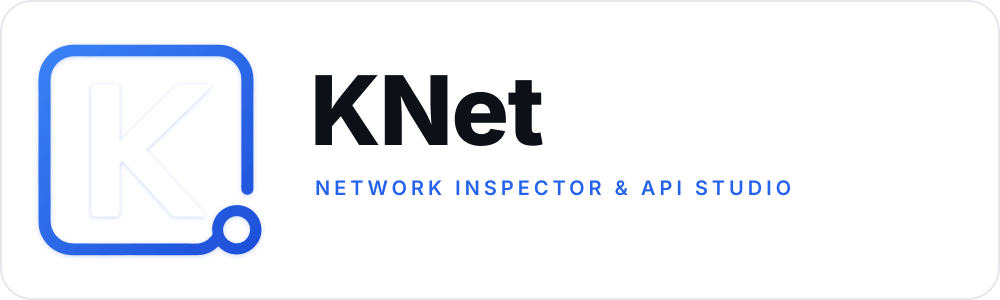
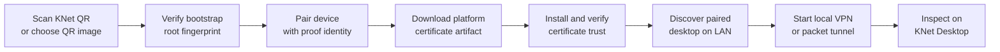
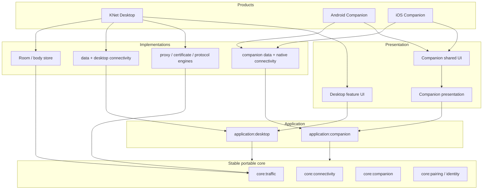

<h1 align="center">
  <picture>
    <source media="(prefers-color-scheme: dark)" srcset="desktopBrand/svg/knet-logo-dark.svg">
    <source media="(prefers-color-scheme: light)" srcset="desktopBrand/svg/knet-logo-light.svg">
    
  </picture>
</h1>

<p align="center">
  <strong>A local-first network inspector and API studio for desktop and mobile application development.</strong>
</p>

<p align="center">
  Capture, inspect, intercept, replay, and understand application traffic from one Kotlin-first toolchain.
</p>

<p align="center">
  <a href="https://github.com/devuloopers/KNet/actions/workflows/ci.yml"></a>
  
  
  
  
</p>

---

KNet is a cross-platform network inspection suite built for developers who need to understand real application
traffic without sending that traffic through a third-party cloud. The desktop application combines a local
intercepting proxy, durable traffic history, live breakpoints, protocol-aware inspection, and API authoring. KNet
Companion extends the same workflow to Android and iOS devices on the local network.

The project is designed around strict dependency boundaries, strongly typed protocol and lifecycle models, bounded
capture, explicit capability maturity, and platform-native security integrations behind Kotlin Multiplatform
contracts.

> [!IMPORTANT]
> KNet is under active development. HTTP/1.x capture and the core desktop workflow are the stable foundation.
> HTTP/2, native gRPC, WebSocket, GraphQL over WebSocket, and live SSE capabilities are implemented and locally
> qualified as **experimental** until their remaining device-matrix and release-soak gates pass.

## Contents

- [What KNet includes](#what-knet-includes)
- [Features](#features)
- [Protocol capability matrix](#protocol-capability-matrix)
- [KNet Companion](#knet-companion)
- [Quick start](#quick-start)
- [Capturing traffic](#capturing-traffic)
- [Architecture](#architecture)
- [Security and privacy](#security-and-privacy)
- [Build and verification](#build-and-verification)
- [Local protocol testing lab](#local-protocol-testing-lab)
- [Project layout](#project-layout)
- [Known limitations](#known-limitations)
- [Contributing](#contributing)
- [Security reports](#security-reports)
- [License](#license)

## What KNet includes

| Product | Platforms | Purpose |
| --- | --- | --- |
| **KNet Desktop** | macOS, Windows, Linux | Owns the proxy, TLS interception, canonical traffic history, breakpoints, API Studio, certificates, connectivity, and protocol inspection. |
| **KNet Companion** | Android 8.0+ and iOS/iPadOS 16+ | Securely pairs a phone or tablet with KNet Desktop, verifies the KNet certificate, and routes supported device traffic through the paired desktop. |
| **Protocol Lab** | JVM | Provides deterministic local HTTP, HTTP/2, SSE, WebSocket, GraphQL, and native gRPC endpoints for development and qualification. |

## Features

### Desktop traffic inspection

- Capture HTTP/1.0, HTTP/1.1, and experimental HTTP/2 traffic through a Netty-based local proxy, including
  multiplexed H2C and TLS/ALPN streams.
- Inspect HTTPS traffic through a locally generated KNet root certificate and per-host TLS interception.
- Search and filter canonical traffic by method, host, path, status, transport, and protocol metadata.
- Keep request/response headers, timing, source attribution, protocol legs, body metadata, and terminal state together
  without embedding large bodies in in-memory exchange models.
- Render JSON, NDJSON/JSONL, HTML, text, images, GraphQL, CBOR, MessagePack, and streaming payloads through bounded,
  content-aware formatters.
- Retain captured history independently from proxy start/stop. The explicit **Clear** action rotates the active
  capture session before terminal sessions and body objects are removed.
- Preserve meaningful interrupted outcomes when the client, proxy, or application disappears before an exchange
  completes.

### Breakpoints and live interception

- Pause matching requests or responses before they continue over the wire.
- Match standard HTTP criteria and protocol-contributed fields through a typed extension registry.
- Edit headers and payloads with explicit patches, forward traffic unchanged, or apply supported drop decisions.
- Keep protocol-specific matching additive: GraphQL, gRPC, WebSocket, and SSE do not add branches to the proxy core
  or generic breakpoint UI.
- Use explicit integer ports in breakpoint rules while keeping default `80` and `443` ports visually concise in
  interception details.

### API Studio

- Author and execute HTTP requests with methods, URLs, query parameters, headers, cookies, authentication, body
  modes, and an explicit HTTP-version preference.
- Save requests in persistent collections and move captured traffic into an editable request workflow.
- Inspect the actual negotiated application protocol instead of inferring it from URL or payload shape.
- Use protocol-specific workspaces for native gRPC, raw WebSocket, and modern GraphQL subscriptions.
- Keep API Studio traffic in the canonical capture pipeline when the local proxy route is active; direct execution
  does not fabricate Traffic rows.
- Apply scripts through a sandboxed application boundary without coupling the UI to the runtime engine.

### Connectivity

- Configure browsers and devices through manual proxy details or deterministic PAC output.
- Generate Apple configuration profiles for supported Apple setup flows.
- Share KNet over the active local network interface with typed IPv4/IPv6 network snapshots and background recovery
  across interface changes.
- Pair KNet Companion using a short-lived QR invitation and authenticated control/data gateways.

### Durable, bounded internals

- Store canonical sessions, connections, exchanges, protocol messages, body objects, annotations, gaps, and deletion
  work in Room/SQLite.
- Keep body bytes behind `BodyRef` and the body-store boundary instead of copying them through UI and domain state.
- Perform semantic inspection after capture so a slow formatter or inspector cannot become part of the forwarding
  hot path.
- Use keyset paging, bounded queues, bounded parsers, defensive payload limits, and deterministic lifecycle cleanup.

## Protocol capability matrix

KNet treats protocol support as a set of independently qualified capabilities. Detecting or parsing a protocol is
not enough to call capture, mutation, replay, or export supported.

| Capability | Capture and inspect | Breakpoints | API Studio | Maturity |
| --- | --- | --- | --- | --- |
| HTTP/1.0 and HTTP/1.1 | Yes | Yes | Yes | **Supported foundation** |
| HTTPS over HTTP CONNECT | Yes, when the client trusts the KNet CA | Yes | Yes | **Supported foundation** |
| GraphQL over HTTP | Semantic request inspection | Operation-aware matching | HTTP GraphQL authoring | **Implemented** |
| SSE bounded post-capture preview | Yes | — | — | **Supported** |
| Live SSE | Live capture and event persistence | Response-event rules | Streaming execution | **Experimental** |
| HTTP/2 (H2C and TLS/ALPN) | Multiplexed capture | Stream-isolated interception | Version-aware execution | **Experimental** |
| Native gRPC | Framing, decoding, messages, status, trailers | Message-aware rules | All four RPC cardinalities | **Experimental** |
| WebSocket over HTTP/1.1 | Frames and logical messages | Message-aware rules | Interactive sessions | **Experimental** |
| `graphql-transport-ws` | Operation correlation and semantic messages | Operation/message rules | Subscription workspace | **Experimental** |
| HTTP/3, WebTransport, WebSocket over HTTP/2 | No | No | No | **Planned / unavailable** |

See the qualification documents for exact evidence and promotion blockers:

- [HTTP/2 target and qualification plan](docs/http2_target_and_implementation_plan.md)
- [gRPC qualification](docs/grpc_qualification.md)
- [WebSocket qualification](docs/websocket_qualification.md)
- [GraphQL over WebSocket qualification](docs/graphql_websocket_qualification.md)
- [SSE qualification](docs/sse_qualification.md)

## KNet Companion

<p align="center">
  <picture>
    <source media="(prefers-color-scheme: dark)" srcset="companionBrand/svg/knet-companion-logo-dark.svg">
    <source media="(prefers-color-scheme: light)" srcset="companionBrand/svg/knet-companion-logo-light.svg">
    
  </picture>
</p>

KNet Companion is a shared Compose Multiplatform product with thin Android and iOS shells. Its setup flow is
reactive and state-driven rather than a sequence of platform-specific duplicate screens.

### Companion setup flow



1. KNet Desktop creates a bounded, expiring `knet://pair/v3` invitation.
2. The companion scans it with the camera or decodes it from an image selected through the platform photo picker.
3. The app performs a credential-free, root-bootstrap-only exchange and verifies the public root against the QR
   fingerprint before a secret-bearing request is sent.
4. Pairing proves the device identity and commits registration plus protected credentials atomically.
5. KNet Desktop supplies the platform artifact: a CA certificate for Android or a `.mobileconfig` profile for
   Apple platforms.
6. The companion guides installation, verifies trust authoritatively, and waits for the user to continue. It does
   not auto-navigate merely because background verification changed.
7. The app rediscovers the paired desktop on the local network. A previously observed LAN address is not treated as
   durable device identity.
8. Inspection starts only after explicit user action and routes supported traffic through the authenticated KNet
   data plane.

### Platform implementations

| Area | Android | iOS / iPadOS |
| --- | --- | --- |
| Shared UI and state | Compose Multiplatform | Compose Multiplatform hosted from SwiftUI |
| QR camera | CameraX + bundled ML Kit | AVFoundation |
| QR image import | Android system photo picker + bounded decoder | PHPicker + Core Image QR detection |
| Durable state | Kotlin Multiplatform DataStore | Kotlin Multiplatform DataStore |
| Secrets and device proof | Android Keystore, AES-GCM, non-exportable P-256 key | Keychain and Security framework identity |
| Discovery | Android NSD / DNS-SD with multicast ownership | Bonjour / Network framework adapters |
| TLS | Ktor OkHttp with pinned paired-root validation | Ktor Darwin with Security-framework trust evaluation |
| Device traffic | Android `VpnService`, TUN-to-SOCKS forwarding | `NEPacketTunnelProvider`, local SOCKS bridge, pinned Hev engine |
| Certificate artifact | `.crt` | `.mobileconfig` |

The app distinguishes desktop availability from certificate trust. If the paired desktop goes offline, its card
becomes unavailable while a previously verified certificate remains represented as previously verified; discovery
continues quietly in the background without repeatedly replacing the UI with a checking state.

> [!NOTE]
> The iOS simulator can validate UI, shared Kotlin code, and framework integration, but it cannot qualify the real
> packet tunnel. A physical-device build requires a paid Apple Developer Program team with the
> `packet-tunnel-provider` Network Extension capability. Apple Personal Teams cannot provision that entitlement.

## Quick start

### Prerequisites

| Goal | Requirements |
| --- | --- |
| Desktop development | Git, JDK 21, macOS/Windows/Linux |
| Android companion | Android Studio or Android SDK 37; Android 8.0 / API 26 or newer |
| iOS companion | macOS, Xcode 16 or newer, iOS/iPadOS 16 or newer |
| Physical iOS inspection | Paid Apple Developer Program team with Network Extension entitlement |

The Gradle Wrapper is included and the project toolchain is pinned to JDK 21. You do not need a system Gradle
installation.

### Clone and run the desktop application

```bash
git clone https://github.com/devuloopers/KNet.git
cd KNet
./gradlew verifyArchitectureFoundation
./gradlew :products:desktop:run
```

On Windows, replace `./gradlew` with `gradlew.bat` when not using a Unix-compatible shell.

### Build the Android companion

```bash
./gradlew :products:companion:androidApp:assembleDebug
```

The debug APK is produced under
`products/companion/androidApp/build/outputs/apk/debug/`.

### Open the iOS companion

```bash
open products/companion/iosApp/KNetCompanion.xcodeproj
```

Select a valid development team for both **KNet Companion** and **KNet Packet Tunnel**. The checked-in Xcode build
phases build and embed the Kotlin frameworks and the pinned native tunnel engine. Simulator builds do not require
the Network Extension entitlement; physical tunnel builds do.

## Capturing traffic

### Desktop or manually configured device

1. Run KNet Desktop and start the proxy.
2. Open **Connect Device** and choose Wi-Fi setup, companion pairing, or another available connection method.
3. Configure the client to use the displayed proxy/PAC details.
4. For HTTPS inspection, install and trust the KNet root certificate only on a device you control.
5. Generate traffic and inspect it in **Traffic**.
6. Remove the proxy configuration and KNet root certificate when the test is complete.

### KNet Companion

1. Keep the desktop and mobile device on the same trusted local network.
2. Start the desktop proxy and open **Connect Companion App**.
3. Scan the QR code or select a saved QR image in KNet Companion.
4. Download, install, and verify the platform certificate/profile.
5. Continue to Home and explicitly start inspection.
6. Inspect the resulting traffic on KNet Desktop.

The companion can rediscover a paired desktop after application restarts and network changes. If the desktop is
temporarily unavailable, the stable unavailable state remains visible while discovery retries in the background.

## Architecture

KNet uses clean dependency direction: portable contracts and application workflows are inward; engines, storage,
connectivity adapters, and product shells are outward. Only product roots own dependency-injection declarations.



### Three runtime planes

| Plane | Responsibility |
| --- | --- |
| **Data plane** | Proxy forwarding, TLS transport, protocol relays, bounded capture publication, and device-tunnel ingress. |
| **Control plane** | Proxy lifecycle, network sharing, pairing, credentials, certificates, discovery, VPN/tunnel state, and shutdown. |
| **Observation plane** | Canonical persistence, indexed queries, traffic presentation, diagnostics, and asynchronous semantic inspection. |

The central invariant is that connectivity mechanisms deliver authenticated bytes to the proxy ingress; they do
not own parsing, canonical storage, body handling, protocol inspection, or Traffic UI behavior.

### Kotlin-first boundaries

- Shared code uses portable Kotlin models, coroutines, serialization, `kotlinx-datetime`, and Kotlin UUID support.
- `commonMain` cannot import Java, Android, UIKit, or other native APIs.
- Native handles do not cross common contracts through `Any` or generic context wrappers.
- Platform differences are implemented as narrow adapters in `androidMain`, `iosMain`, or JVM modules.
- Companion persistence uses Kotlin Multiplatform DataStore; desktop canonical traffic uses Room with bundled SQLite.
- Koin modules live only in executable product composition roots, keeping reusable modules framework-neutral.
- Every Gradle module declares its responsibility and dependency rule in a colocated `MODULE.md`.

The complete module map is maintained in
[docs/module_responsibility_index.md](docs/module_responsibility_index.md). Architectural decisions live under
[docs/adr](docs/adr).

## Security and privacy

KNet is a development tool with security-sensitive capabilities. Its implemented data path is local-first: traffic
is routed directly between your client, KNet Desktop, and the requested upstream service. No KNet cloud relay is
currently implemented.

### Security properties

- The desktop owns a local root CA and a process-stable, CA-signed companion transport identity.
- QR onboarding is bounded and expires. The lightweight bootstrap does not expose a durable device credential.
- Complete invitations are redeemed once through authenticated, pinned TLS.
- Pairing uses device proof and fail-closed atomic persistence; partial pairing state is not restored.
- Companion control and proxy gateways are separate and authenticate their callers.
- Credential refresh uses rotation semantics that reject replay with the old credential.
- Android secrets are protected by Android Keystore-backed cryptography; iOS secrets use Keychain/Security APIs.
- Registration metadata is secret-free. Private keys and credentials are excluded from observable UI state and
  registration serialization.
- Unsupported or malformed inputs are bounded and rejected rather than passed through ambiguously.

### TLS interception warning

KNet can decrypt HTTPS only after the client explicitly trusts the KNet root certificate. Installing a root CA is a
privileged security decision: install it only on test devices you own or are authorized to manage, never distribute
the private CA material, and remove the certificate after testing when it is no longer needed.

Applications using certificate pinning, private trust stores, QUIC-only transports, or policies that ignore the
configured proxy may reject interception. KNet does not bypass those application security controls.

### Local data

Desktop runtime data is stored under `~/.knet`, including the database, body objects, settings, certificate state,
and installation identity. Captured traffic can contain credentials, cookies, personal data, and proprietary API
payloads. Protect that directory, avoid committing captures, and clear data before sharing logs or demonstrations.

The current desktop Room schema is version **26**. During active development, earlier development schemas and old
certificate formats are not migrated; the database may be reset through the configured destructive-migration
policy.

## Build and verification

### Focused product commands

```bash
# Run desktop in development
./gradlew :products:desktop:run

# Create a distributable for the current desktop operating system
./gradlew :products:desktop:createDistributable

# Build Android debug APK
./gradlew :products:companion:androidApp:assembleDebug

# Link the iOS Simulator framework
./gradlew :products:companion:iosApp:linkDebugFrameworkIosSimulatorArm64
```

Desktop packaging is configured for DMG, MSI, EXE, DEB, and RPM. Native installers should be built and tested on
their target operating system.

### Qualification gates

| Command | Scope |
| --- | --- |
| `./gradlew verifyArchitectureFoundation` | Module documentation, dependency direction, UI isolation, Kotlin-first boundaries, product-owned DI, and companion UI ownership. |
| `./gradlew companionFoundationQualification` | Shared companion compilation and tests across JVM, Android, iOS device, and iOS Simulator targets. |
| `./gradlew companionAndroidProductQualification` | Companion foundation, Android tests, lint, and debug APK assembly. |
| `./gradlew companionIosProductQualification` | Companion foundation and iOS Simulator framework linkage. |
| `./gradlew http2Qualification` | HTTP/2 architecture, transport, storage, UI, and integration evidence. |
| `./gradlew grpcQualification` | Native gRPC capture, descriptors, breakpoints, API Studio, storage, and protocol-lab evidence. |
| `./gradlew webSocketQualification` | HTTP/1.1 WebSocket relay, framing, capture, breakpoints, and authoring evidence. |
| `./gradlew graphQLWebSocketQualification` | Modern GraphQL WebSocket semantic inspection and authoring evidence. |
| `./gradlew sseQualification` | SSE preview, live capture, persistence, streaming execution, and breakpoint evidence. |
| `./gradlew phase18ReleaseGate` | Architecture verification, module checks, and desktop distributable creation. |

The checked-in CI workflow runs general verification on Linux and protocol qualification matrices across macOS,
Windows, and Linux where configured. Qualification tasks do not launch the desktop UI.

For the configurable SSE soak:

```bash
./gradlew sseReleaseSoak
# Short local diagnostic run; not release evidence:
./gradlew sseReleaseSoak -Pknet.sse.soak.seconds=60
```

## Local protocol testing lab

Start the independent deterministic test server:

```bash
./gradlew :testingServer:bootRun
```

Default endpoints:

| Service | Address |
| --- | --- |
| Dashboard and HTTP catalog | `http://127.0.0.1:9090/` |
| Machine-readable manifest | `http://127.0.0.1:9090/lab/v1` |
| GraphiQL | `http://127.0.0.1:9090/lab/graphiql` |
| Native gRPC | `127.0.0.1:9091` |
| TLS/ALPN HTTP/2 | `https://localhost:9443/lab/v1/http2/echo` |

The lab includes real HTTP metadata and payload routes, H2C and TLS HTTP/2, native gRPC with reflection and all
cardinalities, raw WebSocket, GraphQL HTTP/subscriptions, SSE variants, chunking, compression, resets, GOAWAY,
trailers, malformed data, delays, and bounded large bodies. It is deliberately independent from production KNet
modules so tests cannot pass by sharing internal transport models.

See [docs/testing_server_protocol_lab.md](docs/testing_server_protocol_lab.md) for the complete endpoint catalog.

## Project layout

```text
KNet/
├── products/
│   ├── desktop/                 Desktop executable and composition root
│   └── companion/
│       ├── di/                  Shared companion product DI definitions
│       ├── androidApp/          Android application shell
│       ├── iosApp/              SwiftUI/Xcode application shell
│       └── iosPacketTunnel/     Lean Kotlin/Native tunnel runtime
├── application/
│   ├── desktop/                 Desktop use cases and ports
│   └── companion/               Portable companion workflows and contracts
├── core/                        Stable domain, traffic, pairing, identity, and connectivity models
├── connectivity/
│   ├── desktop/                 PAC, manual, Apple, LAN, and pairing adapters
│   └── companion/               Android/iOS network, TLS, certificate, and tunnel adapters
├── data/
│   ├── desktop/                 Desktop repositories and runtime adapters
│   └── companion/               Versioned registration and credential adapters
├── engine/                      Proxy, TLS, protocol, formatter, script, session, and simulation engines
├── storage/                     Canonical Room/SQLite persistence
├── ui/
│   ├── core/                    Cross-platform design system
│   ├── desktop/                 Desktop feature modules
│   └── companion/               Shared presentation and Compose Multiplatform UI
├── testingServer/               Independent local protocol lab
├── docs/                        ADRs, qualification evidence, architecture, and implementation history
├── desktopBrand/                Desktop brand sources and exports
└── companionBrand/              Companion brand sources and exports
```

Every included Gradle module has a `MODULE.md` that states what it owns, what it must not own, and which direction
dependencies may flow.

## Known limitations

- Advanced protocol implementations remain experimental until their documented physical-device, operating-system,
  concurrency, and soak evidence is complete.
- HTTP/3, WebTransport, and WebSocket over HTTP/2 are not implemented. QUIC/UDP traffic is not inspectable through
  the current HTTP proxy pipeline.
- Certificate-pinned applications may reject HTTPS interception by design.
- Direct companion operation currently requires the mobile device and desktop to reach each other on the same
  local network. A relay transport is modeled as a future additive capability but is not implemented.
- Full iOS inspection cannot be signed with an Apple Personal Team because Apple restricts the required Network
  Extension capability.
- Per-application traffic selection or attribution is intentionally not offered because it cannot be implemented
  consistently across Android and ordinary consumer iOS without managed-device capabilities.
- Mobile certificate installation remains a platform-owned user action; KNet verifies readiness but does not try to
  bypass system trust UX.

## Contributing

Issues, design discussions, documentation improvements, tests, and focused pull requests are welcome.

Before opening a pull request:

1. Read the affected module's `MODULE.md` and the relevant [architecture decisions](docs/adr).
2. Keep dependency direction inward and put platform APIs only in their platform source set.
3. Add or update tests at the closest contract boundary.
4. Run `./gradlew verifyArchitectureFoundation` and the focused module tests.
5. Run the relevant product or protocol qualification gate for behavior that crosses modules.
6. Update capability documentation without promoting experimental behavior ahead of its evidence.

Use [GitHub Issues](https://github.com/devuloopers/KNet/issues) for reproducible bugs and scoped feature proposals.
Include the operating system, KNet version/commit, protocol, connection method, expected result, and sanitized logs.
Never attach captured credentials, private certificates, access tokens, or proprietary payloads.

## Security reports

Do not report exploitable security issues in a public issue. Use GitHub private vulnerability reporting when it is
available for the repository, or contact the maintainers at
[devuloopers@gmail.com](mailto:devuloopers@gmail.com). Include a minimal reproduction and avoid sending real
captured secrets.

## Responsible use

Use KNet only on devices, applications, accounts, and networks you own or have explicit permission to test. You are
responsible for complying with applicable laws, organizational policies, and third-party terms of service.

## License

A top-level open-source license has not yet been committed. Before the public release, add the selected `LICENSE`
file and update this section. Package metadata alone does not grant permission to use, modify, or distribute the
source.

---

<p align="center">
  Built with Kotlin, Compose Multiplatform, Netty, Ktor, Room, DataStore, and platform-native networking APIs.
</p>
