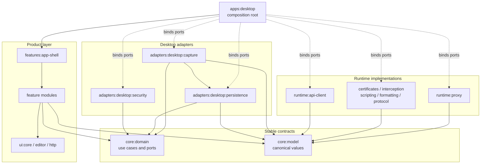
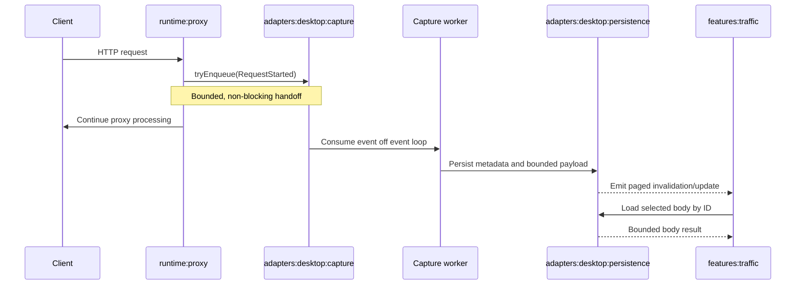

# KNet Scalability Foundation Remediation Plan

Status: Proposed  
Scope: Desktop JVM application, proxy engine, persistence, scripting, UI architecture, testing, and distribution  
Baseline verification: `./gradlew check :products:desktop:assemble --rerun-tasks --no-daemon` completed successfully with 232 executed tasks and 662 passing test cases.

## 1. Objective

Turn KNet from a feature-rich desktop MVP into a secure, bounded, observable, and maintainable foundation that can support:

- Sustained concurrent proxy traffic without blocking Netty event loops.
- Long-running capture sessions without unbounded memory, database, or payload-file growth.
- Safe localhost and explicitly enabled LAN operation.
- Deterministic shutdown and resource ownership.
- Multiple feature teams without increasing cross-module coupling.
- Honest, tested protocol and platform support claims.
- Repeatable performance, security, and release verification.

This plan deliberately avoids a big-bang rewrite. Each phase leaves the application usable and adds tests before removing old paths.

## 2. Foundation decisions

These decisions must be recorded as short architecture decision records before implementation begins.

### 2.1 Supported runtime

Treat KNet as a JVM desktop product for the duration of this plan. Keep reusable code in `commonMain` only when it is actually platform-neutral. Do not advertise Android, iOS, or native support until a second target compiles and runs in CI.

### 2.2 Dependency direction

Adopt and enforce this dependency direction:

```text
apps:desktop
    -> ui:* and desktop composition root
ui:*
    -> core:domain and ui:core
data:desktop
    -> core:domain, storage, and engine adapters
engine:*
    -> platform-neutral core contracts required by the engine
storage
    -> persistence models and database implementation
```

UI modules must not depend directly on engine implementations. Engine modules must not depend on Room DAOs or entities. The application module is the only place that assembles concrete implementations.

### 2.3 Bounded-resource policy

Every queue, cache, body buffer, session, pending-request map, database query, and payload store must have an explicit bound, eviction rule, or retention policy. Defaults must be safe and configurable.

### 2.4 Protocol support policy

A protocol is supported only when it is wired into the production pipeline and covered by an end-to-end test. Models or isolated handlers alone are not sufficient.

## 3. Delivery overview

| Phase | Outcome | Priority | Depends on |
|---|---|---|---|
| 0 | Baselines and automated guardrails | P0 | None |
| 1 | Security, correctness, and lifecycle containment | P0 | Phase 0 |
| 2 | Non-blocking capture and upstream networking | P0 | Phase 1 |
| 3 | Bounded persistence and large-session behavior | P0 | Phases 1-2 |
| 4 | Enforced module boundaries and model consolidation | P1 | Phase 1 |
| 5 | UI and feature-composition scalability | P1 | Phases 3-4 |
| 6 | Protocol, platform, and documentation truth | P1 | Phases 2-5 |
| 7 | Distribution and operational hardening | P2 | Phases 1-6 |

Phases 2 and 4 can run in parallel after Phase 1 if different owners avoid changing the composition root at the same time.

## 3.1 Target project structure

Yes, the structure should change, but the change is primarily about ownership and dependency direction rather than maximizing the number of modules. The migration must be boundary-first: enforce the new dependency rules in the current folders, move code in small feature-specific pull requests, and rename modules only after their responsibilities are stable.

### Current structure, simplified

```text
KNet/
├── products/desktop             Product bootstrap and composition
├── core/
│   ├── domain                  Domain, UI state, and some JVM concerns
│   ├── http                    HTTP models and Ktor client implementation
│   ├── logger
│   ├── pairing                 Mostly disconnected
│   └── serialization
├── data/desktop                Repositories joining engines and Room
├── engine/
│   ├── certificate
│   ├── formatter
│   ├── interceptor
│   ├── portal
│   ├── protocol
│   ├── proxy
│   ├── script
│   ├── session                 Directly coupled to storage
│   ├── simulator               Mostly disconnected
│   └── traffic                 Parallel traffic-modification path
├── storage                     Room and payload persistence
├── ui/
│   ├── core
│   └── desktop/*               Product features and reusable components
└── testingServer
```

The main current problem is not the folder names. It is that UI, domain, engine, and persistence responsibilities cross these folder boundaries in both directions.

### Recommended end state

```text
KNet/
├── products/
│   └── desktop/                        Composition root and process lifecycle
│
├── core/
│   ├── model/                          Canonical HTTP, traffic, auth, and script values
│   ├── domain/                         Use cases and technology-free ports
│   ├── logging/                        Logging contract and common implementation
│   └── serialization/                  Platform-neutral serialization helpers
│
├── runtime/
│   ├── proxy/                          Netty server, downstream/upstream channels
│   ├── certificates/                   CA and leaf-certificate operations
│   ├── interception/                   Rules, breakpoints, and traffic modification
│   ├── scripting/                      Bounded Graal/script execution
│   ├── formatting/                     Body formatter implementations
│   ├── api-client/                     Ktor API Studio transport
│   ├── portal/                         Local setup portal, host-restricted
│   └── protocol/                       Only production-wired protocol handlers
│
├── adapters/
│   └── desktop/
│       ├── capture/                     Capture queue and canonical session writer
│       ├── persistence/                 Room DAOs, entities, migrations, payload files
│       └── security/                    OS key store and secure file fallback
│
├── features/
│   ├── app-shell/                       Window shell and navigation only
│   ├── traffic/                         Paged traffic UI and presentation state
│   ├── api-studio/                      API request builder UI and presentation state
│   ├── breakpoints/                     Breakpoint management UI
│   ├── certificates/                    Certificate and device-setup UI
│   ├── scripting/                       Script management UI
│   └── settings/                        Application settings UI
│
├── ui/
│   ├── core/                            Design tokens and generic Compose components
│   ├── editor/                          Reusable JVM desktop code editor
│   └── http/                            Reusable HTTP presentation components
│
└── testing/
    ├── support/                         Fakes, fixtures, leak checks, test builders
    ├── server/                          Deterministic local protocol server
    └── benchmarks/                      Load, large-session, and soak harnesses
```

This target has a similar number of modules to the current repository. The improvement comes from every top-level group having one clear role:

- `core` defines stable values and contracts without framework dependencies.
- `runtime` performs networking, certificates, formatting, and script execution.
- `adapters` owns Room, files, key stores, and capture persistence.
- `features` owns user-facing behavior and presentation state.
- `ui` contains reusable visual components with no application orchestration.
- `apps:desktop` is the only composition root allowed to see all concrete implementations.

### Target dependency flow



The dotted composition edges are allowed only inside `apps:desktop`. Feature modules receive domain ports through dependency injection and never import concrete runtime or adapter classes.

### Runtime request flow after restructuring



This removes filesystem, Room, decompression, and presentation work from the Netty event loop. It also prevents the UI from observing and retaining the entire transaction table.

### Current-to-target module mapping

| Current module | Target location | Change |
|---|---|---|
| `apps:desktop` | `apps:desktop` | Keep; restrict to bootstrap, lifecycle, and dependency wiring. |
| `core:domain` | `core:model`, `core:domain`, relevant `features:*` | Split canonical values from use cases; move UI state and display properties into features. |
| `core:http` | `core:model`, `runtime:api-client` | Move shared HTTP values to model; isolate the Ktor implementation. |
| `core:logger` | `core:logging` | Rename only if useful; keep framework-neutral. |
| `core:pairing` | `features:certificates` or remove | Integrate into authenticated LAN/device setup or keep out of production. |
| `core:serialization` | `core:serialization` | Keep after verifying it remains platform-neutral. |
| `data:desktop` | `adapters:desktop:capture` and feature adapters | Split the capture hot path from ordinary repository adapters. |
| `storage` | `adapters:desktop:persistence` | Own Room, migrations, payload files, retention, and reconciliation together. |
| `engine:proxy` | `runtime:proxy` | Keep Netty-only concerns; emit capture events through a port. |
| `engine:certificate` | `runtime:certificates` | Keep certificate operations; move protected key persistence to the security adapter. |
| `engine:interceptor`, `engine:traffic` | `runtime:interception` | Consolidate rules, breakpoints, and request/response modification. |
| `engine:formatter` | `runtime:formatting` | Keep formatter implementations behind a domain-facing formatter port. |
| `engine:script` | `runtime:scripting` | Own bounded execution; expose only script-use-case contracts. |
| `engine:portal` | `runtime:portal` | Keep as a host-restricted local endpoint. |
| `engine:protocol` | `runtime:protocol` or remove | Retain only production-wired and end-to-end-tested protocols. |
| `engine:session` | `adapters:desktop:capture` | Merge into the single canonical session writer; remove direct Room coupling from engine code. |
| `engine:simulator` | `testing:support` or remove | Treat as test tooling unless it becomes a wired product feature. |
| `ui:desktop:app`, `ui:desktop:workspace` | `features:app-shell` | Merge navigation and shell ownership; remove feature implementation knowledge. |
| `ui:desktop:traffic` | `features:traffic` | Use paged domain APIs and lazy body loading. |
| `ui:desktop:apistudio` | `features:api-studio` | Depend on an API-client port instead of Ktor/script implementations. |
| `ui:desktop:breakpointManager` | `features:breakpoints` | Depend on breakpoint use cases. |
| `ui:desktop:certificate` | `features:certificates` | Depend on certificate and pairing/setup use cases. |
| `ui:desktop:scripting` | `features:scripting` | Depend on script-management and execution use cases. |
| `ui:desktop:settings` | `features:settings` | Own user-configurable policies, not their runtime implementations. |
| `ui:desktop:codeEditor` | `ui:editor` | Keep JVM-specific and replace AWT clipboard integration. |
| `ui:desktop:httpPanel` | `ui:http` | Keep as reusable presentation-only components. |
| `testingServer` | `testing:server` | Keep and expand into deterministic integration fixtures. |

### Composition root after restructuring

`apps:desktop` should assemble the application in one visible place:

```text
ProxyController        <- NettyProxyRuntime
CaptureSink            <- BoundedCaptureQueue
TrafficRepository      <- RoomTrafficRepository
PayloadRepository      <- FilePayloadRepository
CertificateService     <- CertificateRuntime + SecureKeyStore
BreakpointService      <- InterceptionRuntime
ScriptService          <- BoundedScriptRuntime
ApiClient              <- KtorApiClient
ApplicationScope       <- DesktopLifecycle
```

Feature modules receive only the left-hand contracts. Concrete classes on the right remain private to the desktop composition root and their implementation modules.

### Migration shape

Do not move the whole repository in one pull request. Use this sequence:

1. Add dependency rules while retaining current module names.
2. Introduce `core:model` and migrate one duplicated concept at a time.
3. Introduce capture and lifecycle ports, then place adapters behind them.
4. Move the canonical session writer and Room implementation into desktop adapters.
5. Convert one feature at a time from direct engine imports to domain ports.
6. Consolidate parallel engine modules only after callers use the new ports.
7. Move/rename directories after imports and public APIs have stabilized.
8. Remove compatibility adapters and deprecated models after all callers migrate.

Temporary compatibility adapters are acceptable during migration, but every adapter must have an owner, removal issue, and deadline. Dependency rules must prevent new code from using the legacy direction.

### What does not need to change

- Compose Desktop remains the application UI technology.
- Netty remains appropriate for the proxy runtime.
- Room remains appropriate for indexed local metadata storage.
- Ktor remains appropriate for API Studio transport.
- Koin can remain the dependency-injection mechanism if bindings stay in the composition root.
- Existing feature screens can migrate incrementally without a visual redesign.
- Existing database and payload data should be migrated in place rather than discarded.

## 4. Phase 0: Baselines and guardrails

### Goal

Make regressions visible before changing runtime behavior.

### Work

1. Add architecture decision records for runtime target, module dependency direction, protocol support, and data-retention policy.
2. Introduce Gradle convention plugins for Kotlin/JVM, Kotlin Multiplatform JVM-only modules, Compose modules, and test configuration.
3. Add formatting and static analysis with repository-wide configuration.
4. Add coverage reporting. Start by recording the baseline; introduce meaningful thresholds after shallow tests are replaced.
5. Add dependency analysis and fail CI on newly introduced unused or incorrectly exposed dependencies.
6. Add automated dependency-boundary tests that reject UI-to-engine and engine-to-storage imports.
7. Add binary/public API reporting. New declarations should be `internal` unless they are intentionally part of a module contract.
8. Create a proxy benchmark harness with deterministic local HTTP, HTTPS, slow-response, large-body, failed-connect, and connection-reset endpoints.
9. Record baseline measurements for throughput, latency, memory, open file descriptors, event-loop stalls, database growth, and payload-directory growth.
10. Separate test categories into unit, component, integration, end-to-end, benchmark, and soak suites. Rename tests that do not cross a real integration boundary.

### Acceptance criteria

- CI executes formatting, static analysis, unit/component tests, dependency rules, and desktop assembly.
- A benchmark report can be reproduced locally with a single documented command.
- At least one test fails when a forbidden module dependency is introduced.
- Existing false-green proxy tests are strengthened to fail on pipeline exceptions and leaked Netty buffers.
- Baseline results and the test hardware profile are committed under `docs/`.

## 5. Phase 1: Security, correctness, and lifecycle containment

### 5.1 Network exposure

1. Add an explicit `ProxyBindPolicy` configuration.
2. Bind to loopback by default.
3. Require the user to explicitly enable LAN access.
4. In LAN mode, require a pairing token or authenticated client policy before forwarding traffic.
5. Add client allow/deny rules, connection limits, request-rate limits, and audit logging.
6. Display the active bind address and exposure warning in the UI.
7. Restrict setup portal routes to the KNet portal host and configured local aliases. A matching path on an arbitrary upstream host must never be intercepted.

### 5.2 Certificate authority protection

1. Introduce a `CertificateKeyStore` contract.
2. Prefer the operating-system secure credential/key store where practical.
3. For file fallback, create private-key files with owner-only permissions and validate permissions when loading them.
4. Make CA export an explicit user action that clearly distinguishes certificate-only export from private-key backup.
5. Add key rotation, corrupt-file recovery, and migration tests.

### 5.3 Script execution safety

1. Pass request and response data through Graal bindings instead of interpolating data into JavaScript source.
2. Run every script in an isolated, owned execution context on a dedicated bounded executor.
3. Enforce timeout by closing/cancelling the execution context, not only by cancelling a coroutine.
4. Wire the existing script validator into every production execution path.
5. Set limits for source length, result size, execution time, and concurrent executions.
6. Add adversarial tests for quote injection, infinite loops, memory pressure, host access, IO access, thread creation, and process access.

### 5.4 Resource ownership and Netty correctness

1. Replace unmanaged coroutine scopes with injected application or feature scopes.
2. Register the proxy server, database, API client, script executors, DNS resources, and background workers with `ApplicationLifecycle`.
3. Define deterministic start, stop, restart, and partial-startup-failure behavior.
4. Release retained Netty messages on connect failure, cancellation, timeout, handler removal, and channel close.
5. Add Netty leak-detection tests at `PARANOID` level for error paths.
6. Add TTL and disconnect eviction to pending requests.
7. Remove process-global mutable registries or scope them to an explicit proxy/application instance.

### Acceptance criteria

- A fresh installation listens only on loopback.
- LAN clients cannot proxy a request without authorization.
- External hosts using `/setup`, `/ca`, `/favicon.ico`, or related paths are forwarded normally.
- Private-key fallback files are owner-readable only.
- Infinite scripts terminate within the configured deadline and leave no execution thread behind.
- Repeated proxy start/stop cycles leave no open port, worker, scope, or database resource.
- Netty leak detection reports no leaks across success and failure integration suites.

## 6. Phase 2: Non-blocking capture and upstream networking

### 6.1 Capture pipeline

1. Define immutable `CaptureEvent` values for request-started, response-completed, failed, dropped, and WebSocket/protocol events.
2. Make the Netty callback perform only bounded copying, timestamping, and non-blocking enqueue.
3. Process protocol inspection, compression decoding, payload writes, and Room writes on owned IO/CPU workers.
4. Use a bounded channel with observable capacity and an explicit overflow policy.
5. Preserve transaction metadata when overloaded. If configured, discard or truncate bodies first and record the reason on the transaction.
6. Batch compatible database writes without delaying interactive traffic visibility beyond a defined budget.
7. Move breakpoint rule evaluation and body decoding away from the event loop while preserving channel backpressure with `autoRead` control.

### 6.2 Certificates and DNS

1. Make leaf-certificate cache population atomic so concurrent misses generate once per host.
2. Replace clear-all eviction with a bounded LRU or weighted cache.
3. Precompute certificate/TLS contexts on a worker and resume the channel pipeline when ready.
4. Bound DNS work and add resolution/connect timeouts with distinct error reporting.

### 6.3 Upstream connection management

1. Define an `UpstreamConnectionManager` contract.
2. First preserve current one-request behavior behind that contract.
3. Add safe HTTP/1.1 keep-alive reuse keyed by scheme, host, port, proxy policy, and TLS configuration.
4. Bound idle and total connections and implement idle eviction.
5. Add retry policy only for operations proven to be replay-safe.
6. Cache reusable client TLS contexts where configuration permits.
7. Remove or integrate the dormant connection-pool implementation so there is one canonical path.

### Observability

Expose counters and timings for:

- Active downstream and upstream connections.
- Capture queue depth, high-water mark, dropped bodies, and dropped events.
- Event-loop task duration and detected stalls.
- DNS, connect, TLS, first-byte, and full-response latency.
- Certificate-cache hits, misses, generation time, and evictions.
- Payload-write and database-write duration.

### Acceptance criteria

- No filesystem, Room, decompression, formatting, or script work runs on a Netty event-loop thread.
- Queue saturation behavior is deterministic, visible in the UI/logs, and covered by tests.
- Failed and cancelled upstream connects release all retained messages.
- A 30-minute concurrent benchmark does not show continuously growing threads, direct memory, pending requests, or open connections.
- Keep-alive reuse measurably reduces connections and TLS handshakes without changing captured semantics.

## 7. Phase 3: Bounded persistence and large-session behavior

### 7.1 Canonical session writer

1. Choose one session-writing path and remove parallel repository/session-manager implementations.
2. Model transaction state explicitly: pending, completed, failed, dropped, and truncated.
3. Use a transaction-safe upsert so a late pending write cannot replace a completed transaction.
4. Make payload references and transaction metadata consistent across crashes.
5. Add startup reconciliation for orphan payloads, missing payloads, and interrupted writes.

### 7.2 Query and indexing strategy

1. Replace full-table observation with keyset/cursor paging ordered by timestamp and stable ID.
2. Push method, host, status, protocol, time range, and textual filtering into database queries.
3. Add indexes based on measured query plans.
4. Add direct `getTransactionById` and paged session APIs.
5. Preserve duplicate HTTP headers; do not collapse semantically repeatable headers through `toMap()` conversions.

### 7.3 Retention and payload storage

1. Add configurable maximum session count, transaction count, database size, payload size, and age.
2. Provide policies for metadata-only capture, body-size truncation, and content-type exclusions.
3. Delete payloads when transactions or sessions are deleted.
4. Use a retryable deletion/outbox mechanism when database and filesystem operations cannot be atomic.
5. Expose storage usage, cleanup progress, and retention configuration in settings.
6. Stream large API Studio responses to bounded storage instead of unconditionally buffering the full body in memory.

### 7.4 Migration safety

1. Add migration tests from every supported database version to the latest schema.
2. Test recovery from missing, corrupt, and partially written payloads.
3. Define backup/export compatibility before deleting legacy columns or formats.

### Acceptance criteria

- Opening and filtering a large session does not load every transaction into memory.
- Clearing a session removes both database rows and associated payload files.
- Retention converges to the configured limits without blocking capture.
- Fast responses cannot be overwritten by a delayed pending insert.
- Large or endless response streams remain within configured memory and disk limits.
- A generated large-session fixture is exercised in CI or a scheduled performance workflow.

## 8. Phase 4: Enforced module boundaries and model consolidation

### 8.1 Domain cleanup

1. Move Compose colors, labels, display state, and feature-specific UI state out of `core:domain`.
2. Remove JVM-only APIs from platform-neutral source sets or hide them behind interfaces with JVM implementations.
3. Consolidate duplicate HTTP method, body type, authentication, script language, and execution-result models.
4. Keep conversions at explicit module boundaries and test round-trip behavior.

### 8.2 Port and adapter boundaries

1. Define domain-facing use cases/facades for certificate management, breakpoints, formatting, scripting, and proxy control.
2. Make UI features depend on those contracts rather than engine types.
3. Move Room-backed session implementation out of `engine:session` and into a desktop data/storage adapter.
4. Keep Netty, Room, Ktor, Graal, SQLite, and OS integrations out of public domain APIs.
5. Replace broad `api(...)` dependencies with `implementation(...)` unless transitive exposure is intentional and documented.

### 8.3 Module inventory

For every module, mark it as one of:

- Production and wired.
- Experimental and excluded from product claims.
- Test support.
- Scheduled for removal.

Integrate or remove dormant session, traffic-modifier, simulator, pairing, workspace, inspector, WebSocket, and connection-pool paths. Do not keep multiple competing implementations of the same responsibility.

### 8.4 Public API reduction

1. Generate an initial public API report.
2. Change implementation classes, helpers, models, and registries to `internal` by default.
3. Document the intentionally public surface of every reusable module.
4. Require API review when a pull request expands that surface.

### Acceptance criteria

- Automated rules prevent UI-to-engine and engine-to-storage dependencies.
- `core:domain` has no Compose, Room, Netty, Ktor, Graal, AWT, or filesystem types.
- Each core concept has one canonical model or a documented boundary conversion.
- No production module is unowned or ambiguously wired.
- Public API growth is visible and reviewed in CI.

## 9. Phase 5: UI and feature-composition scalability

### Work

1. Replace eager construction of all feature view models with destination-scoped creation and disposal.
2. Split large view models into state reducers/use cases and smaller coordinators.
3. Split oversized screens into stateful containers and stateless sections with narrow inputs.
4. Replace `WorkspaceHost` cross-feature mediation with typed navigation results or application-level coordinators.
5. Add navigation state restoration, explicit back-stack behavior, and testable route contracts if product requirements need them.
6. Connect traffic filters and pagination directly to the paged repository APIs.
7. Ensure expensive body decoding and formatting stays off the UI thread and remains cached with bounded memory.
8. Enforce the repository responsive-layout rules through shared layout primitives and targeted UI tests.
9. Replace Java AWT clipboard use in shared source with the approved Compose clipboard APIs.

### Acceptance criteria

- Inactive features do not retain view models, collectors, or large state.
- Traffic list memory remains bounded as session size grows.
- Navigation and cross-feature actions are testable without constructing the entire application graph.
- No UI frame performs database-wide filtering or large-body decoding.
- Module dependency rules remain green as features are split.

## 10. Phase 6: Protocol, platform, and documentation truth

### 10.1 HTTP/2 and WebSocket decision

For each protocol, choose one path:

1. Wire it into the production proxy with negotiation, lifecycle, capture, breakpoint limitations, and end-to-end tests.
2. Explicitly mark it experimental and keep it out of default product claims.
3. Remove unused implementations until there is an approved product requirement.

HTTP/2 support requires ALPN negotiation, stream-aware transaction identity, multiplexing-safe state, flow-control handling, and end-to-end TLS tests. WebSocket support requires upgrade handling, bidirectional frame lifetime, fragmentation, close/error handling, and bounded frame capture.

### 10.2 Multiplatform decision

1. If KNet remains desktop JVM, simplify misleading source-set or documentation claims where useful.
2. If true multiplatform is approved, add a second target immediately and let compilation drive abstraction work.
3. Introduce platform services for URI handling, time, filesystem access, clipboard, secure storage, networking, and process integration.

### 10.3 Documentation reconciliation

1. Make `docs/` the documentation source of truth and migrate relevant `project_docs/` content.
2. Update module counts, Room version, content limits, and actual runtime flows.
3. Publish a capability matrix with `supported`, `experimental`, and `planned` states.
4. Document security boundaries, LAN mode, certificate handling, retention defaults, and overload behavior.
5. Keep architecture diagrams aligned with dependency tests and production wiring.

### Acceptance criteria

- Every advertised protocol has a production end-to-end test.
- README limits and architecture statements match executable configuration.
- Multiplatform claims match targets built in CI.
- Documentation identifies experimental modules and known limitations.

## 11. Phase 7: Distribution and operational hardening

### Work

1. Add dependency vulnerability and license scanning.
2. Generate an SBOM for release artifacts.
3. Sign and notarize macOS artifacts and sign Windows installers where release policy requires it.
4. Remove release-script failure suppression for required packaging steps.
5. Verify the advertised architecture of every artifact instead of labelling runner-specific output as universal.
6. Add artifact installation and first-launch smoke tests on each supported operating system.
7. Define structured diagnostic export with secrets, authorization headers, cookies, bodies, tokens, and private keys redacted by default.
8. Add an opt-in crash/diagnostic strategy with a documented privacy model.
9. Define release rollback and database downgrade/forward-recovery policy.

### Acceptance criteria

- Release artifacts are reproducible, scanned, and matched to their declared platform architecture.
- Required signing/notarization failures stop the release.
- Diagnostic exports contain no known secret classes in adversarial tests.
- Installation and launch smoke tests pass for every published format.

## 12. Performance and reliability gates

Absolute targets should be finalized after Phase 0 baselines on reference hardware. Until then, every phase must satisfy these non-negotiable gates:

- No blocking filesystem or database operation on a Netty event loop.
- No unbounded in-memory collection, queue, cache, response buffer, or pending map in a traffic path.
- No continuously growing heap, direct memory, thread count, file descriptor count, or payload directory during steady-state soak testing with retention enabled.
- No uncaught pipeline exception accepted as a passing end-to-end test.
- No captured request can finish in an internally older state than it previously reached.
- Shutdown releases all owned resources within a documented deadline.
- Overload produces visible, counted truncation or rejection rather than silent data loss or application failure.

Initial load profiles should cover:

1. Many short HTTP/1.1 requests with keep-alive.
2. HTTPS requests spread across many hostnames.
3. Slow uploads and downloads.
4. Bodies below, at, and above configured limits.
5. Upstream DNS, connect, TLS, reset, and timeout failures.
6. Breakpoints held, resumed, modified, dropped, and abandoned.
7. Queue saturation and low-disk conditions.
8. Large stored sessions with simultaneous capture, filtering, selection, and deletion.

## 13. Pull-request sequence

Keep pull requests narrow and land them in this order:

1. ADRs, test taxonomy, benchmark harness, and dependency rules in reporting-only mode.
2. Loopback default, portal host restriction, and LAN-mode configuration.
3. Certificate-key protection.
4. Script bindings and enforceable termination.
5. Lifecycle ownership, pending-request eviction, and Netty leak fixes.
6. Capture-event channel and asynchronous payload/database workers.
7. Transaction-state schema and race-free canonical session writer.
8. Retention, payload reconciliation, and session deletion.
9. Paged DAO, indexed filtering, and direct transaction lookup.
10. Traffic UI paging and lazy body presentation.
11. Certificate cache and upstream connection manager.
12. Domain-model consolidation and dependency inversion, one feature boundary at a time.
13. Dormant-module integration or removal.
14. Protocol decisions and production end-to-end coverage.
15. Documentation, release security, SBOM, signing, and platform smoke tests.

Each pull request must include tests for its failure paths and must not combine behavioral migration with unrelated formatting or mass renaming.

## 14. Project-wide definition of done

The remediation is complete when:

- The proxy is loopback-only by default and LAN operation is explicitly authorized.
- Private keys have an approved protected-storage strategy.
- Script execution is isolated, bounded, and forcibly terminable.
- Netty event loops perform no blocking capture work.
- Capture overload, body truncation, and retention are explicit and observable.
- Sessions are paged, filtered in storage, and cleaned together with their payloads.
- Application resources have one deterministic lifecycle.
- Module boundaries are automatically enforced.
- Duplicate core models and parallel runtime implementations are resolved.
- Public APIs are intentionally limited and tracked.
- Protocol and platform claims are backed by production end-to-end tests.
- CI enforces formatting, static analysis, dependency rules, tests, and packaging.
- Soak tests demonstrate stable resource usage on documented reference hardware.
- Release artifacts are correctly identified, scanned, and verified on their target operating systems.

## 15. Progress tracking

Track each phase in `docs/implementation_plan.md` only when implementation starts. Record:

- Owner and pull-request links.
- Schema or configuration migrations.
- Baseline and post-change measurements.
- Tests added or replaced.
- Documentation updated.
- Remaining risks and explicit deferrals.

Do not mark a phase complete based only on compilation. Its acceptance criteria and applicable performance/reliability gates must pass.
