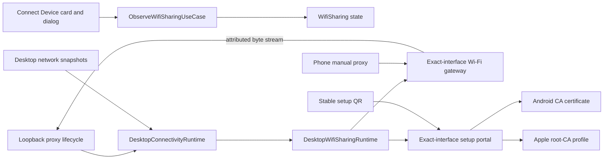

# KNet Wi-Fi Device Connectivity Implementation Plan

> [!NOTE]
> This document describes the manual Wi-Fi setup increment and preserves its dated scope. The authenticated Android
> and iOS companion path was implemented later and remains a separate pre-release capability. Use the
> [documentation map](README.md) for current status.

- **Status:** Implemented; real Android/iPhone conformance and packaged capacity checks pending
- **Updated:** 2026-08-19
- **Scope:** Stock Android, iPhone, and iPad clients on the same local network as KNet Desktop
- **Architecture source of truth:** `docs/target_architecture_and_implementation_plan.md`

## 1. Approved outcome

Wi-Fi is KNet's primary stock-phone connectivity path:

1. The existing proxy starts on loopback.
2. `DesktopWifiSharingRuntime` observes that lifecycle and automatically binds an exact non-loopback IPv4
   address using the same numeric proxy port.
3. Any local client capable of reaching that exact address may use the proxy. There is no invitation,
   confirmation code, remembered IP approval, device registration, or manual Wi-Fi enable switch.
4. A dedicated setup listener exposes one stable `/setup` URL. The desktop displays that URL as a QR code.
5. The mobile HTML page offers an Android DER CA certificate and a valid Apple root-CA configuration profile.
6. Stopping the proxy or losing the selected address closes Wi-Fi resources without clearing traffic.
7. Restarting the proxy recreates the gateway automatically. If the desktop retains the same LAN address,
   the phone's saved manual proxy configuration continues working without verification.

The companion is a separate authenticated path for devices that use the companion's local VPN/packet tunnel.
Companion identity and Room persistence do not participate in manual Wi-Fi connectivity. Remote relay transport
remains unavailable.

## 2. Repository changes

### KEEP

- `:engine:proxy` remains loopback-only and owns HTTP/TLS proxy behavior.
- Canonical traffic, body ownership, breakpoints, inspectors, and storage remain independent of connectivity.
- `DesktopConnectivityRuntime` remains the versioned proxy/network endpoint coordinator.
- `IngressAttributionRegistry` carries gateway attribution into canonical traffic.
- Manual proxy, PAC, Apple setup-provider, ADB, pairing, and companion-gateway implementations remain
  independent mechanisms.
- Exact-interface binding, bounded total connections, and bounded per-source connections remain enforced.

### MODIFY

- `WifiSharing` is read-only; the platform runtime follows proxy lifecycle instead of receiving UI
  enable/disable commands.
- `WifiSharingState.Active` exposes only its session and metrics.
- The LAN endpoint advertises `OPEN_LAN_CLIENT`, and traffic uses `WifiLanClient` ingress attribution.
- `WifiLanProxyGateway` admits every reachable source while preserving global and per-source quotas.
- `WifiSetupPortal` serves stable, strict-authority routes rather than invitation-scoped routes.
- Connect Device contains a top-left wrapping connectivity-method grid whose first card opens focused
  Wi-Fi setup content in the shared right-side drawer shell.

### REMOVE

- Wi-Fi invitation service and token routes.
- Pending-client observation and confirmation codes.
- Source approval, rejection, revocation, and registered-device association.
- Separate Enable/Disable Wi-Fi controls and network-address selector.
- Pending, approved, and known-device panels from Connect Device.
- Manual-Wi-Fi registration kind; durable identity remains companion-only.

### ADD

- Resource-backed responsive mobile setup HTML.
- Android `knet-ca.crt` download.
- Apple `knet-ca.mobileconfig` download containing a conformant `com.apple.security.root` payload.
- Stable PAC download route for clients that support it.
- Automatic retry for recoverable address/certificate/bind availability.

## 3. Runtime and dependency flow



Dependency direction remains:

```text
:ui:desktop:connectivity -> :application:desktop -> :core:connectivity / :core:traffic
:products:desktop -> :connectivity:desktop -> :application:desktop / :core:*
:connectivity:desktop -X-> :engine:proxy implementation
```

The Wi-Fi adapter receives the loopback endpoint through `ProxyRuntime` and forwards bytes to it; it
does not import Netty handlers, certificate engines, traffic persistence, or UI.

## 4. Listener and lifecycle rules

- Bind only one concrete non-loopback IPv4 address; never bind `0.0.0.0`.
- Prefer ordinary interfaces over VPN, tunnel, Docker, bridge, and peer-to-peer virtual interfaces.
- Prefer private/local IPv4 addresses when more than one viable address exists.
- Use the running loopback proxy's numeric port for the LAN proxy listener.
- Use setup port `8181`, or `8183` when the proxy itself uses `8181`.
- Publish the LAN endpoint only after both gateway and setup listeners start successfully.
- Roll back both listeners if either bind fails, then retry while the proxy and network remain available.
- Stop and withdraw the LAN endpoint when the proxy stops.
- Rebind automatically when the selected address disappears and another viable address exists.
- Never rotate capture sessions or clear traffic as a side effect of Wi-Fi lifecycle changes.
- Process restart cannot preserve live TCP sockets. Phones reconnect on their next request without approval.

## 5. Mobile setup routes

| Route | Media type | Responsibility |
|---|---|---|
| `/` and `/setup` | `text/html; charset=utf-8` | Responsive setup page with proxy endpoint and both platform guides |
| `/knet-ca.crt` and `/ca` | `application/x-x509-ca-cert` | DER root CA for Android/manual installation |
| `/knet-ca.mobileconfig` | `application/x-apple-aspen-config` | Apple root-CA configuration profile |
| `/proxy.pac` | `application/x-ns-proxy-autoconfig` | Optional PAC file using the current exact LAN endpoint |

The setup listener validates the Host authority against its bound address, accepts GET only, caps certificate
size, disables caching, supplies `nosniff`, uses a restrictive content-security policy, and never proxies an
unknown route upstream.

## 6. Mobile user experience

The desktop destination deliberately contains one entry point:

- one square **Wi-Fi Proxy Setup** card at the top-left of a wrapping connectivity-method grid;
- live status: proxy stopped, preparing, ready endpoint, or attention required;
- click opens a non-modal right-side setup drawer shared visually with Live Intercept;
- ready state shows the stable QR, setup URL, manual proxy host/port, and Android/iPhone steps;
- stopped state offers the existing application proxy-start use case;
- no approval or registered-device UI is shown.

The mobile page contains:

- a clear proxy host and port;
- separate Android and Apple download cards;
- installation and manual Wi-Fi proxy steps;
- the CA SHA-256 fingerprint;
- a warning that pinned apps or apps excluding user CAs may not be inspectable.

## 7. Security boundary

This mode is intentionally an open developer-tool proxy on one local interface while the proxy is running.
It is not an authentication system. Resource limits, exact-interface binding, no NAT traversal, and no
wildcard listener remain the safety boundaries. Anyone who can reach the selected desktop address and port
can send traffic through KNet.

The authenticated companion gateway remains separate and continues to use pairing credentials. Adding a
future allow-list or authenticated Wi-Fi mode must be a new access policy, not a reintroduction of hidden
approval behavior into this open mode.

## 8. Verification status

Automated coverage verifies:

- resource-backed HTML rendering and both download links;
- Apple root-CA payload rendering;
- strict setup-page authority and open artifact delivery;
- open LAN bridging and source-address traffic attribution;
- automatic gateway activation and shutdown with proxy lifecycle;
- focused ViewModel state, stable QR generation, and desktop composition compilation.

Still required before release:

- real Android certificate installation and HTTP/HTTPS capture;
- real iPhone/iPad profile installation, full-trust enablement, and HTTP/HTTPS capture;
- firewall prompts on macOS, Windows, and Linux;
- network switching, sleep/wake, DHCP address changes, VPN coexistence, and IPv6 policy validation;
- measured connection/capacity and extended soak gates in packaged applications.
