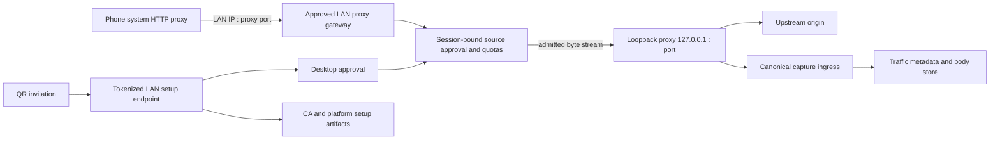

# KNet Wi-Fi Device Connectivity Implementation Plan

- **Status:** In progress; backend foundation implemented, desktop UI and real-device conformance pending
- **Date:** 2026-08-18
- **Scope:** Android and iPhone/iPad clients on the same local network as KNet Desktop
- **Architecture source of truth:** `docs/target_architecture_and_implementation_plan.md`
- **Boundary decision:** `docs/adr/0004-connectivity-and-companion-ingress.md`

## Implementation checkpoint

Implemented on 2026-08-18 without UI changes:

- portable Wi-Fi session/client/configuration/state models and application ports/use cases;
- truthful connectivity capability and LAN endpoint access policy;
- exact-interface, approved-source LAN gateway forwarding to the unchanged loopback proxy;
- canonical `WifiApprovedDevice` ingress attribution, bounded total/per-client admission, metrics, and
  immediate active-socket revocation;
- source-bound expiring invitations, pending-client confirmation, approval/rejection, and a strict-host
  setup endpoint serving the CA and PAC only after approval;
- proxy/network invalidation, atomic listener startup rollback, shutdown ordering, feature-grouped Koin
  wiring, and focused backend/architecture tests;
- suppression of manual/PAC/Apple phone descriptors when only a loopback proxy endpoint exists.

Still pending by explicit product sequencing:

- the `Connect Device` Compose feature, interface selection, QR rendering, instructions, and actions;
- a conformant Apple installation/profile flow (the LAN portal deliberately does not advertise one yet);
- real Android/iPhone HTTP, HTTPS/CONNECT, CA-trust, firewall, sleep/wake, IPv6, VPN, and capacity testing;
- adding the focused Wi-Fi suite to the packaged release gate after those conformance checks pass.

## 1. Outcome

Wi-Fi sharing becomes KNet's primary way to connect a physical phone:

1. The user starts the existing loopback proxy.
2. The user explicitly enables **Wi-Fi Sharing** for one selected network interface.
3. KNet starts a bounded LAN gateway and a token-protected setup endpoint on that exact interface.
4. The user scans a QR code, approves the observed phone on the desktop, installs the KNet CA, and
   configures the phone's Wi-Fi proxy.
5. The LAN gateway admits only approved source addresses, attributes their connections, and forwards
   byte streams to the unchanged loopback proxy.
6. Disabling sharing, revoking a device, changing networks, or shutting down closes the relevant LAN
   sockets without stopping the proxy, clearing traffic, or changing capture/storage behavior.

The first delivery targets stock phone proxy settings and therefore does not require a companion app.
A future companion remains the stronger cryptographically authenticated option for untrusted networks,
apps that ignore system proxy settings, and VPN-based whole-device capture.

## 2. Current repository state and gap

### KEEP

- `StartLoopbackProxyUseCase` starts the production proxy on `127.0.0.1`, port `8080` by default.
- `DesktopProxyRuntimeAdapter` rejects wildcard and unauthenticated LAN bindings before Netty starts.
- `DesktopConnectivityRuntime` already combines proxy endpoints with versioned desktop network state.
- Manual, PAC, Apple-profile, and ADB providers already derive artifacts from a `ConnectivityContext`.
- `IngressAttributionRegistry` already transfers a gateway-owned client identity into canonical traffic.
- Canonical traffic, body storage, breakpoints, inspectors, and persistence are independent of connectivity.
- Pairing, encrypted trusted-device storage, and the loopback bearer-authenticated companion gateway remain
  available for a later companion product.

### MODIFY

- Manual/PAC/Apple availability must require a reachable Wi-Fi endpoint when the descriptor targets a
  different device. A loopback endpoint must never be presented as phone-reachable.
- The setup delivery adapter must support an explicitly activated, exact LAN binding with tokenized
  routes. The existing unrestricted loopback setup routes remain local-only.
- Traffic ingress vocabulary must distinguish a stock Wi-Fi-approved client from a cryptographically
  authenticated companion client. The current `LanPairedDevice` name must not overstate authentication.
- Desktop composition and lifecycle must start Wi-Fi resources only after explicit user activation,
  rather than starting a LAN listener during application bootstrap.

### ADD

- An application-owned Wi-Fi sharing contract and use cases.
- A desktop LAN proxy gateway with source approval, quotas, connection attribution, and deterministic
  shutdown.
- A Wi-Fi onboarding/setup session with expiring one-time tokens.
- A first-class `:ui:desktop:connectivity` feature and `Connect Device` navigation destination.
- QR onboarding, device approval/revocation, CA fingerprint display, and platform-specific instructions.
- Focused security, lifecycle, network-transition, interoperability, and end-to-end tests.

### MOVE / REMOVE

- **MOVE:** no proxy, traffic, storage, PAC, ADB, or certificate implementation is moved between modules.
- **REMOVE:** no existing connectivity mechanism is removed. Any descriptor that incorrectly advertises
  a loopback address to a phone is suppressed rather than retained for compatibility.

## 3. Non-negotiable architecture invariants

1. The Netty proxy remains loopback-only and unaware of Wi-Fi, QR codes, pairing, operating systems,
   network interfaces, and UI.
2. The LAN gateway is owned by `:connectivity:desktop` and only bridges admitted bytes to the published
   loopback proxy endpoint.
3. Wi-Fi sharing never owns traffic models, body bytes, persistence, inspectors, or breakpoints.
4. Starting or stopping Wi-Fi sharing never clears traffic and never rotates the capture session.
5. No wildcard LAN bind is inferred. The user selects an address and KNet binds that exact address.
6. Wi-Fi sharing is disabled by default and is not restored automatically after application restart.
7. Unknown LAN clients are denied. A phone must complete a short-lived onboarding and desktop approval.
8. Secrets and onboarding tokens never enter traffic records, logs, URLs shown after expiry, or setup
   descriptors returned to unrelated callers.
9. Network changes invalidate published endpoints and setup artifacts without migrating or restarting
   the proxy engine.
10. Future companion/VPN/relay work must be able to reuse the loopback proxy and canonical traffic path
    without changing this Wi-Fi gateway.

## 4. Security model and explicit limitation

Stock Android Wi-Fi proxy settings do not provide a reliable, cross-application way to attach KNet's
current bearer credential to every HTTP request and CONNECT tunnel. Requiring proxy authentication would
therefore make Wi-Fi sharing unreliable as the primary setup path.

The stock-phone mode uses **physically initiated, network-bound approval**:

- a 256-bit, single-client invitation is displayed as a QR code on the desktop;
- the phone opens the invitation through the exact LAN setup endpoint;
- the desktop shows the source address, interface, expiry, and a short confirmation code;
- the user explicitly approves that source for the current Wi-Fi-sharing session;
- the gateway associates the approved source address with an opaque client ID;
- approvals expire when sharing stops or the selected network changes;
- per-client and global connection limits constrain abuse;
- revocation immediately closes active sockets.

This protects KNet from accidentally becoming an open LAN proxy and provides an explicit user-consent
boundary. It does **not** provide cryptographic proof on every proxied connection: another host capable of
source-address impersonation on a hostile LAN could attempt to reuse an approved address. Consequently:

- the UI must label this mode **Trusted local network only**;
- sharing must never bind on all interfaces or expose itself through UPnP/NAT traversal;
- remembered authorization across networks is prohibited;
- the companion/tunnel path remains the required strong-authentication mode for untrusted networks.

KNet may later offer Basic proxy authentication for clients that support it, but Basic support is an
additional access policy and is not a prerequisite for the primary stock-phone flow.

## 5. Target runtime flow



Detailed connection sequence:

1. `EnableWifiSharingUseCase` verifies that the loopback proxy is running and chooses the selected
   `NetworkAddress` from `DesktopNetworkSnapshotMonitor`.
2. `WifiSharingPort.enable(...)` binds the gateway and setup listener atomically. If either bind fails,
   both roll back and no endpoint is published.
3. The runtime publishes a versioned LAN setup session containing safe display data, endpoint metadata,
   certificate fingerprint, invitation expiry, and QR payload.
4. The phone opens `/invite/{token}`. The token becomes bound to that source for its short lifetime and
   the source becomes a pending client; another source cannot replay it.
5. The desktop user approves the pending client. The approval is scoped to the current sharing session
   and network-context version.
6. The phone uses the advertised LAN IP and proxy port. The gateway rejects sources without an active
   approval and bridges approved connections under bounded backpressure.
7. Before opening the internal socket, the gateway registers a one-shot `IngressContext`. The internal
   proxy claims it and canonical traffic records retain the Wi-Fi client identity.

## 6. Module and package changes

| Module | Change | Responsibility |
|---|---|---|
| `:engine:proxy` | **KEEP** | Loopback HTTP/TLS transport, forwarding, interception, and capture boundary. No Wi-Fi imports or behavior. |
| `:core:traffic` | **MODIFY narrowly** | Add or rename the ingress kind so approved stock Wi-Fi and authenticated companion ingress are truthful. No Wi-Fi lifecycle types. |
| `:core:connectivity` | **ADD** | Portable Wi-Fi sharing identifiers, endpoint/session state, pending/approved client summaries, typed failures, and capability token. |
| `:application` | **ADD** | `WifiSharingPort`, enable/disable/observe/approve/revoke use cases, and serialized orchestration with proxy/network context. |
| `:connectivity:desktop` | **ADD/MODIFY** | Exact-interface LAN gateway, invitation/setup endpoint, approval registry, descriptor integration, network reconciliation, and platform detection. |
| `:data:desktop` | **KEEP initially** | No persistence is required for session-only approvals. Add an adapter only if non-secret device labels are later persisted. |
| `:storage` | **KEEP** | No Wi-Fi tables in the first delivery. Traffic already stores ingress kind and optional client identity. |
| `:ui:desktop:connectivity` | **ADD** | Connect Device screen, QR, interface selection, pending approvals, device list, instructions, and health/error presentation. |
| `:ui:desktop:app` | **MODIFY** | Add the `Connect Device` destination and host the new feature screen. |
| `:products:desktop` | **MODIFY** | Feature-grouped Koin bindings and shutdown registration. No behavior in the composition root. |

Every new Gradle module root receives a `MODULE.md`. Adding only `:ui:desktop:connectivity` is justified
because connectivity becomes a first-class product feature; the runtime implementation remains inside
the existing `:connectivity:desktop` module.

Recommended packages:

```text
core/connectivity/.../model/wifi/
  WifiSharingModels.kt

application/.../port/connectivity/wifi/
  WifiSharingPort.kt
application/.../usecase/connectivity/wifi/
  EnableWifiSharingUseCase.kt
  DisableWifiSharingUseCase.kt
  ObserveWifiSharingUseCase.kt
  ApproveWifiClientUseCase.kt
  RevokeWifiClientUseCase.kt

connectivity/desktop/.../wifi/
  DesktopWifiSharingRuntime.kt
  WifiLanProxyGateway.kt
  WifiClientApprovalRegistry.kt
  WifiInvitationService.kt
  WifiSetupPortal.kt
  WifiEndpointSelector.kt

ui/desktop/connectivity/.../
  model/
  viewmodel/
  view/
  components/
```

## 7. Application contracts and state

Add one feature-specific port rather than expanding `ConnectivityCoordinator` into a god object:

```text
WifiSharingPort
  state: StateFlow<WifiSharingState>
  enable(command): WifiSharingResult
  disable(reason): WifiSharingResult
  createInvitation(): WifiInvitation
  approve(candidateId, displayName): ApprovalResult
  reject(candidateId): Unit
  revoke(clientId): Unit
```

`WifiSharingState` is an immutable sealed hierarchy:

- `Disabled`
- `Enabling`
- `AwaitingApproval(session, pendingClients, approvedClients)`
- `Active(session, pendingClients, approvedClients, metrics)`
- `NeedsUserAction(reason, availableAddresses)`
- `Disabling`
- `Failed(code, recoverable)`

The session model exposes only presentation-safe data:

- opaque session ID;
- exact proxy and setup endpoints;
- selected interface ID/address family;
- network-context version;
- CA SHA-256 fingerprint;
- invitation expiry;
- setup instructions and QR payload.

Invitation tokens and internal credentials remain private to `:connectivity:desktop` and are never stored
inside observable UI state after consumption.

## 8. LAN gateway design

`WifiLanProxyGateway` is independent from Netty protocol parsing:

- binds one exact IPv4 or IPv6 interface address and a configured port;
- accepts only while the sharing lifecycle is active;
- checks the remote source against the session approval registry;
- enforces a total connection limit and a lower per-client limit;
- sets bounded initial-header, connect, idle, and shutdown deadlines;
- connects only to the currently published loopback proxy endpoint;
- registers one-shot ingress attribution before bridging;
- copies bytes in both directions under socket/coroutine backpressure;
- closes all sockets for a revoked client immediately;
- exposes counters and typed health without exposing mutable socket collections;
- rejects forwarding to arbitrary targets and cannot be configured as a general TCP relay.

The first implementation may reuse small proven pieces from `AuthenticatedProxyGateway` only where the
code is genuinely identical. Do not introduce a generic gateway framework before both implementations
demonstrate a stable shared seam.

Preferred port behavior:

- keep the internal proxy on `127.0.0.1:<configured proxy port>`;
- bind the Wi-Fi gateway to `<selected LAN IP>:<same proxy port>` when available;
- if that exact address/port is occupied, report a typed conflict and let the user choose another port;
- never fall back silently to `0.0.0.0`.

## 9. Setup, certificate, PAC, and Apple behavior

### Setup endpoint

- Bind only while Wi-Fi sharing is active and only to the selected interface address.
- Use high-entropy single-use invitation paths with short expiry and bounded failed attempts.
- Require the invitation for the setup index, CA, PAC, and generated-profile routes.
- Send `Cache-Control: no-store`, `X-Content-Type-Options: nosniff`, and strict response-size limits.
- Redact tokens from logs and remove consumed/expired artifacts.
- Keep the existing loopback setup endpoint separate from LAN exposure.

### Manual proxy

Manual configuration is the compatibility baseline:

- Android/iOS server: selected desktop LAN address;
- port: active Wi-Fi gateway port;
- bypass list: optional localhost/local-network values, explicitly shown;
- desktop confirmation: connection is not accepted until the phone is approved.

### PAC

PAC is an optional convenience after manual proxy succeeds:

- generate it from the active Wi-Fi gateway endpoint, never the loopback proxy endpoint;
- serve it only through the active invitation/setup session;
- keep proxy fallback policy explicit;
- invalidate it on interface, address, port, or sharing-session change.

### Certificates

- Show the CA fingerprint on the desktop and setup page.
- Provide platform-specific installation and removal instructions.
- Do not claim that installing a CA makes every app interceptable.
- Android apps targeting modern platform versions commonly need Network Security Configuration to trust
  user-added CAs; pinned/custom TLS stacks can still reject interception.
- A manually installed Apple root must be explicitly enabled for full SSL trust.

### Apple profile

Treat the current generated profile as requiring real-device conformance before it is advertised as a
one-step proxy setup. The implementation must:

- use valid Apple payload structure and unique generated UUIDs;
- separate certificate installation from Wi-Fi-specific proxy configuration when SSID information is
  unavailable;
- default to manual Wi-Fi proxy instructions plus a certificate payload;
- validate installation, removal, trust, and network-change behavior on a supported iPhone/iPad.

## 10. UI and user journey

Add a primary navigation destination named **Connect Device**.

Disabled state:

- explain that KNet and the phone must be on the same trusted Wi-Fi;
- list viable interface addresses and require explicit selection when more than one exists;
- show the proxy port and a `Start Wi-Fi Sharing` action;
- warn when a VPN/default-route condition makes the selected address questionable.

Active state:

- display a QR code, setup URL, proxy host/port, CA fingerprint, and invitation countdown;
- provide tabs or concise steps for Android and iPhone;
- show pending phones with source address and `Approve`/`Reject` actions;
- show approved clients, active connection counts, last activity, and `Revoke`;
- provide `Generate New QR`, `Copy Setup`, and `Stop Sharing` actions;
- show a persistent `Trusted local network only` security label.

Traffic presentation may later filter/group by ingress client identity, but Wi-Fi delivery does not depend
on a Traffic UI redesign.

## 11. Lifecycle and network-state behavior

Wi-Fi sharing lifecycle is serialized with a coroutine `Mutex` in the application adapter:

```text
Disabled -> Enabling -> Active -> Disabling -> Disabled
                      -> NeedsUserAction
                      -> Failed
```

- **Application start:** Wi-Fi sharing remains disabled; no LAN socket is opened.
- **Enable:** verify proxy running, validate selected current interface, atomically start portal + gateway,
  then publish state.
- **Proxy stop:** disable Wi-Fi sharing first and await socket closure.
- **Network address/interface change:** stop accepting, close active LAN sockets, expire approvals and
  invitations, and enter `NeedsUserAction`; do not restart the proxy or clear traffic.
- **Sleep/wake:** revalidate the selected address and require reactivation when reachability changed.
- **Revoke:** remove approval first, then close that client's sockets.
- **Application shutdown:** stop Wi-Fi portal/gateway before the loopback proxy, capture writer, and DB.
- **Failure:** rollback every partially opened listener and retain a recoverable typed error.

## 12. Delivery phases

### Phase A — Capability truth and contracts [IMPLEMENTED]

- Add Wi-Fi-specific core/application models and port.
- Make phone descriptors unavailable when only loopback endpoints exist.
- Add architecture tests proving no proxy/UI/storage dependency crosses into the wrong module.
- Decide and document the truthful ingress-kind migration while backward compatibility is unnecessary.

**Gate:** no UI or setup descriptor can claim that `127.0.0.1` is reachable from another device.

### Phase B — Exact-interface gateway vertical slice [BACKEND IMPLEMENTED; DEVICE CONFORMANCE PENDING]

- Implement source approval registry and LAN byte bridge.
- Bind exact IPv4 address first; retain model support for IPv6 and add IPv6 after device conformance.
- Forward to the existing loopback proxy and register ingress attribution.
- Add limits, timeouts, revocation, deterministic shutdown, and bind rollback.

**Gate:** one approved test client completes HTTP and HTTPS CONNECT through the gateway; an unapproved
client, wrong interface, saturated client, and revoked client are rejected without proxy changes.

### Phase C — Secure onboarding and artifacts [PARTIAL]

- Implement invitation generation/expiry and first-source binding so one phone can retrieve its required
  setup artifacts while other sources cannot replay the token.
- Add token-protected LAN setup delivery, CA fingerprint, manual instructions, and PAC regeneration.
- Correct and validate Apple profile payload behavior before advertising it.

Invitation generation, source-bound claim/expiry, CA/PAC delivery, and approval gates are implemented.
Apple profile delivery remains intentionally unavailable until real-device validation.

**Gate:** tokens cannot be replayed, guessed in bounded tests, leaked through logs, or reused after a
network/session change; artifact routes reject missing/wrong/expired tokens.

### Phase D — First-class desktop UI [PENDING USER-DIRECTED UI WORK]

- Add `:ui:desktop:connectivity`, its `MODULE.md`, ViewModel, immutable state, QR rendering, and platform
  instructions.
- Add `Connect Device` navigation and feature-grouped Koin bindings.
- Add approve/reject/revoke and explicit stop-sharing flows.

**Gate:** UI tests cover every lifecycle state and no Compose type enters application/connectivity core.

### Phase E — Real-device interoperability [PENDING]

- Android: Chrome/browser HTTP+HTTPS, a test app trusting the KNet CA, an app that ignores system proxy,
  and a pinned app with truthful unsupported messaging.
- iOS/iPadOS: Safari HTTP+HTTPS, CA installation/full trust/removal, manual Wi-Fi proxy, and validated
  profile behavior.
- macOS, Windows, and Linux hosts: firewall prompts, interface selection, sleep/wake, VPN transitions,
  and address changes.

**Gate:** a documented device matrix records OS/device versions, successful paths, and known limits.

### Phase F — Capacity, security, and release gate [PARTIAL]

- Concurrent approved phones and per-client saturation.
- Slow clients, abrupt disconnects, repeated enable/disable, revoke-under-load, and network changes.
- Descriptor/file/socket recovery and zero lingering LAN listeners after disable.
- Attempted open-proxy access, unauthorized source, token replay, hostile Host/authority, oversized headers,
  and log-redaction tests.
- Add Wi-Fi integration tests to `phase18ReleaseGate` only after focused gates are stable.

**Gate:** packaged desktop verification passes and the supported Wi-Fi capacity envelope is documented.

## 13. Definition of done

Wi-Fi support is complete only when:

- a fresh KNet installation exposes no LAN listener;
- a user can connect a stock Android phone and iPhone on the same trusted Wi-Fi without terminal commands;
- setup never advertises loopback to another device;
- unknown clients cannot use KNet as a proxy;
- approved clients are attributed in canonical traffic and can be revoked immediately;
- HTTP and supported HTTPS traffic appear in the existing Traffic/API/breakpoint pipeline without model
  conversion or a parallel store;
- stopping/restarting sharing preserves captured traffic;
- network changes invalidate access and artifacts without restarting the core proxy;
- certificate trust and pinning limitations are shown truthfully;
- `:engine:proxy`, canonical traffic contracts, PAC/manual provider contracts, and storage architecture do
  not require migration;
- focused real-device, security, resource, architecture, and packaged-runtime gates pass.

## 14. Deferred additive work

The following are intentionally outside the stock Wi-Fi delivery and remain additive:

- Android/iOS companion applications;
- Android `VpnService` and Apple Network Extension capture;
- cryptographically authenticated direct tunnels over Wi-Fi;
- remote relay/NAT traversal;
- HTTP/2, HTTP/3, WebSocket, and gRPC transport support;
- bypass of third-party certificate pinning.

These features can reuse the existing pairing, loopback proxy, ingress attribution, canonical traffic,
body storage, and application query/control boundaries. They do not block Wi-Fi manual-proxy support.
